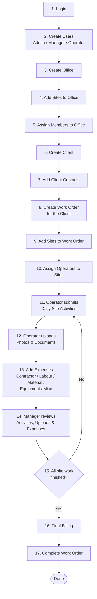

```mermaid
flowchart TD
    A[1. Login] --> B[2. Create Users<br/>Admin / Manager / Operator]
    B --> C[3. Create Office]
    C --> D[4. Add Sites to Office]
    D --> E[5. Assign Members to Office]
    E --> F[6. Create Client]
    F --> G[7. Add Client Contacts]
    G --> H[8. Create Work Order<br/>for the Client]
    H --> I[9. Add Sites to Work Order]
    I --> J[10. Assign Operators to Sites]
    J --> K[11. Operator submits<br/>Daily Site Activities]
    K --> L[12. Operator uploads<br/>Photos & Documents]
    L --> M[13. Add Expenses<br/>Contractor / Labour / Material /<br/>Equipment / Misc]
    M --> N[14. Manager reviews<br/>Activities, Uploads & Expenses]
    N --> O{15. All site work<br/>finished?}
    O -- No --> K
    O -- Yes --> P[16. Final Billing]
    P --> Q[17. Complete Work Order]
    Q --> R([Done])
```
